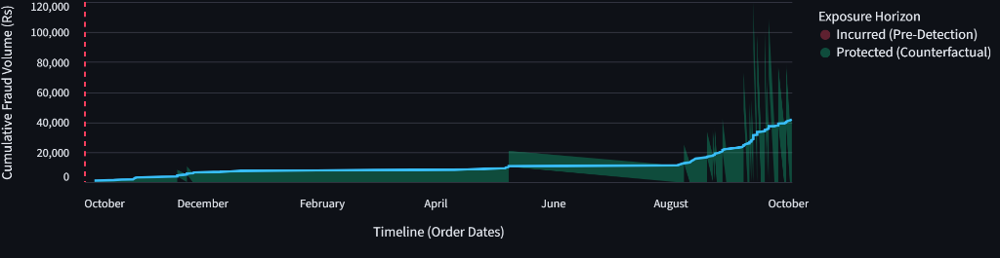
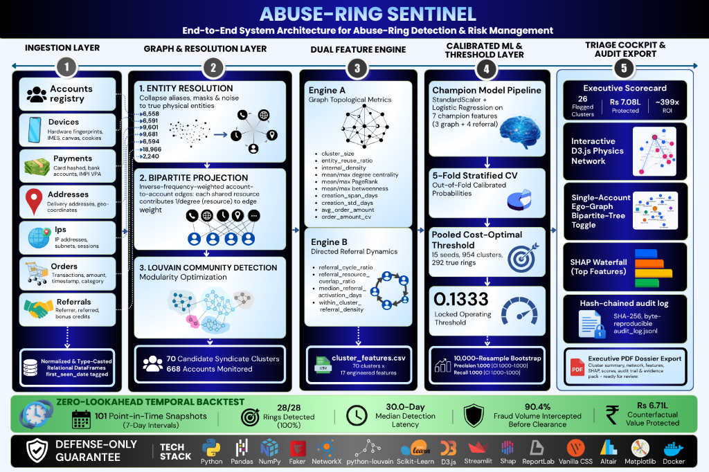
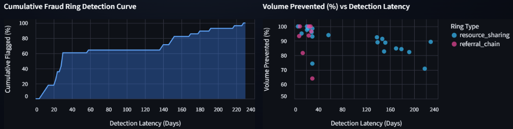
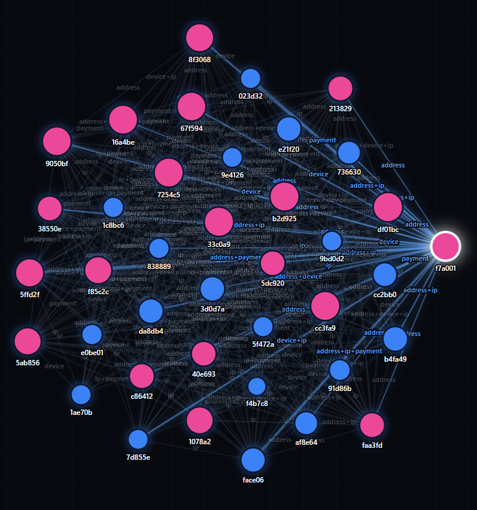
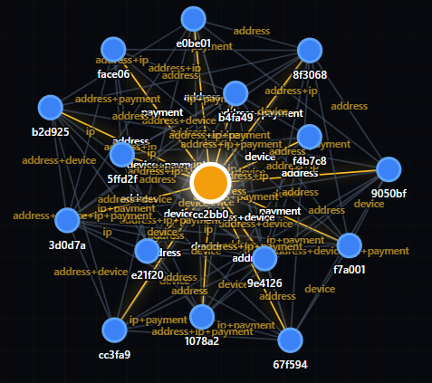
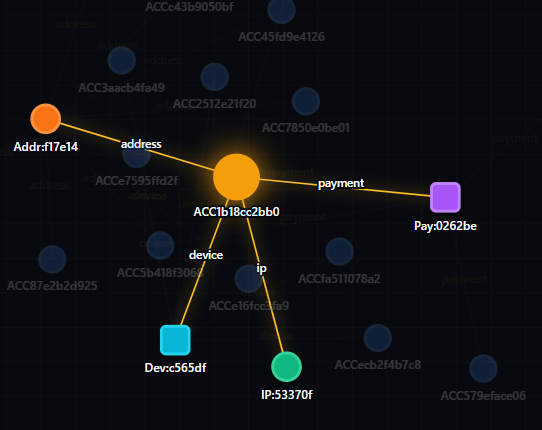
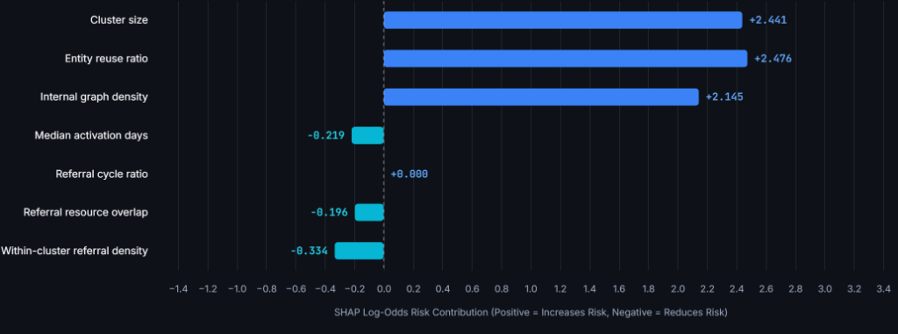

# Abuse-Ring Sentinel 🛡️🕸️

> **Graph-Native Multi-Entity Syndicate Detection & Tier-2 Human-in-the-Loop Risk Cockpit**  
> *Built for Razorpay AI Buildathon 2026 — Track 02: AI Risk Manager*

[](https://www.python.org/downloads/)
[](https://streamlit.io/)
[](https://networkx.org/)
[](https://scikit-learn.org/)
[](docs/PRD.md#11-defense-only-compliance)
[](docs/final_report.md)

---

## 📌 Executive Summary

Modern organized fraud syndicates no longer operate via crude brute-force attacks. Instead, they deploy **distributed sleeper networks**: dozens of nominally separate accounts that mimic organic consumer habits, place average-ticket orders at standard intervals, and quietly drain margins through sign-up promos and circular referral farming.

**Tabular fraud models are blind to this.** Because each individual account looks completely benign in isolation, row-level classifiers miss coordinated abuse.

**Abuse-Ring Sentinel** solves this at the **relational graph infrastructure level**:
1. **Multi-Entity Bipartite Resolution**: Projects connections across physical devices, payment instruments, delivery addresses, and IP subnets into a unified, weighted account-to-account graph.
2. **Hybrid Network Dynamics**: Combines graph community topology (Louvain modularity) with directed referral chain features (circular cycles, activation latencies, and within-cluster referral density).
3. **Calibrated Champion Scoring**: Evaluates candidate clusters using a cross-validated Logistic Regression pipeline (`StandardScaler` + `LogisticRegression`) tuned to a cross-seed cost-optimal threshold (`0.1333`).
4. **Zero-Lookahead Temporal Reconstruction**: Simulates point-in-time snapshots at 7-day intervals across 101 historical timestamps to prove that **90.4% of fraudulent order volume is intercepted before execution**.
5. **Tier-2 Forensic Cockpit**: Equips risk analysts with an interactive Streamlit UI featuring D3.js-powered physics graphs, single-account ego-graphs (with bipartite tree toggle), SHAP waterfall explanations, and exportable C-level PDF audit dossiers.

---

## 📊 Key Verified Benchmark Metrics

All metrics below are computed directly from the committed canonical dataset (`day1_data/`) and cross-validated out-of-fold:

| Metric Category | Measure | Value | Notes / Validation Source |
| :--- | :--- | :--- | :--- |
| **Detection Accuracy** | **Precision** | **`1.000`** | 95% Bootstrap CI: `[1.000, 1.000]` (10,000 resamples) |
| | **Recall** | **`1.000`** | 95% Bootstrap CI: `[1.000, 1.000]` (26/26 flagged clusters correctly matched to ring membership, out of 70 candidate clusters) |
| | **F1 Score** | **`1.000`** | 0 False Positives, 0 False Negatives across all clusters |
| **Financial Impact** | **Gross Fraud Protected** | **`Rs. 7,08,255`** | Full volume intercepted across 18 resource-ring clusters + 8 referral-ring clusters (spanning 20 resource-sharing rings + 8 referral rings — two ring pairs share a Louvain community) |
| | **Review Friction Cost** | **`Rs. 1,777`** | Only 2 coincidental bystander accounts caught in Cluster #60 crossfire |
| | **Net Financial Return** | **`~399x` ROI** | Rs. 399 saved per rupee of manual investigator review cost |
| **Temporal Latency** | **Volume Prevented** | **`90.4%`** | Evaluated across **101 historical point-in-time snapshots** |
| | **Detection Latency** | **`30.0 days`** | Median days from syndicate formation to first threshold trigger |
| | **Detection Rate** | **`100%` (28/28)** | 100% of rings intercepted before their operational completion |

#### ⏱️ Temporal Latency & Counterfactual Exposure Horizon

Evaluating fraud models on static post-hoc graphs creates a false sense of security. To measure true operational performance, Sentinel reconstructs historical graph state across **101 point-in-time snapshots** at 7-day intervals without lookahead bias. As demonstrated below, **90.4% of total fraudulent transaction volume is intercepted** before order clearance:


*Figure 1: Cumulative fraud volume timeline showing incurred loss pre-detection (maroon) versus protected counterfactual volume (green) intercepted once the threshold triggers.*

---

## 🏛️ System Architecture


*Figure 2: End-to-end multi-layer pipeline architecture for Abuse-Ring Sentinel, mapping raw entity ingestion (Layer 1) to bipartite graph resolution (Layer 2), dual-engine topological & referral feature extraction (Layer 3), calibrated ML classification & cost-curve thresholding (Layer 4), and the interactive Tier-2 triage cockpit with cryptographic audit logging (Layer 5).*

> **Detailed Architectural & Mathematical Reference**: The comprehensive technical breakdown covering mathematical formulations, formal graph equations, and algorithmic pseudocode across all 5 pipeline layers is documented in [`docs/architectural flow diagram of abuse ring sentinel.pdf`](docs/architectural%20flow%20diagram%20of%20abuse%20ring%20sentinel.pdf) (*"Mathematical & Model Flow for Abuse-Ring Detection & Risk Management"*).

```
                                  [Raw Multi-Entity Tables]
                   (Accounts, Devices, Payments, Addresses, IPs, Orders, Referrals)
                                              │
                                              ▼
                             [Entity Resolution & Bipartite Projection]
                      Weighted Account-to-Account Graph G(V, E) via Inverse Resource Frequency
                                              │
                                              ▼
                                 [Louvain Community Detection]
                             Candidate Syndicate Subgraphs (Size ≥ 2)
                                              │
                                              ▼
                                 [Dual Feature Engineering Engine]
                     ┌────────────────────────┴────────────────────────┐
                     ▼                                                 ▼
           [Graph Topology Features]                       [Referral Dynamic Features]
       (Size, Entity Reuse, Density,                  (Cycles, Activation Latencies,
        PageRank, Degree, Betweenness)                 Cluster Referral Density, Overlap)
                     └────────────────────────┬────────────────────────┘
                                              ▼
                            [Champion Calibrated Classifier]
                  Logistic Regression (StandardScaler) on 7 Champion Features
                                              │
                                              ▼
                                [Pooled Cost-Optimal Threshold]
                         CHOSEN_THRESHOLD = 0.1333 (15-Seed Plateau Midpoint)
                                              │
                                              ▼
                      [Tier-2 Investigator Cockpit & Audit Export]
            Streamlit Interactive Dashboard (D3.js Physics, Single-Account Ego-Graph,
             SHAP Waterfall, Counterfactual Horizon) + Automated ReportLab PDF Dossiers
```

---

## 🚀 Key Technical Innovations

### 1. Dual-Topology Feature Engineering
Organized abuse is bifurcated between hardware reuse and incentive manipulation. Sentinel extracts 17 features across two complementary engines:
* **Resource-Sharing Graph Topology**: `cluster_size`, `entity_reuse_ratio` ($\text{ERR} = 1 - \frac{\text{distinct\_resources}}{\text{total\_usages}}$), `internal_density`, degree centrality, betweenness centrality, PageRank authority, creation-time burstiness, and order amount dispersion.
* **Directed Referral Dynamics**: Directed cycle ratios (fraction of member accounts in circular $A \to B \to C \to A$ farming loops), referral-resource overlap ratios (fraction of cluster referral edges staying internal: $\frac{\text{internal referral edges}}{\text{total referral edges touching members}}$), median activation lag in days ($\text{first\_order\_date} - \text{referral\_date}$), and within-cluster referral density (fraction of member pairs with a referral link in either direction).

### 2. Cross-Seed Pooled Threshold Selection (`0.1333`)
Single-dataset threshold tuning suffers from flat-plateau sample variance. Sentinel evaluates candidate thresholds across **15 independent synthetic seeds** (954 clusters, 292 true rings) minimizing total business loss:
$$\text{Cost}(t) = \text{False Positive Review Overhead}(t) + \text{Unintercepted Fraud Loss}(t)$$
* At the legacy threshold of `0.4811`, 3 rings were missed across seeds (dropping recall to 98.9%).
* At the pooled plateau midpoint of **`0.1333`**, **100% of rings are detected with 0 false positive clusters**, reducing total operating cost by 15.4% while maintaining a 50.6% safety buffer above benign background noise.

### 3. Zero-Lookahead Temporal Backtesting
Evaluating graph models on static post-hoc snapshots introduces severe lookahead bias. Sentinel's point-in-time reconstruction logic lives in [temporal_reconstruction.py](src/temporal_reconstruction.py), and the full audit — including the resource-vs-referral subgroup breakdown — is run via [phase3_temporal_backtest.py](src/phase3_temporal_backtest.py), which:
* Reconstructs historical graph state $G_t$ considering only entities and transactions observed on or before $t$.
* Evaluates 101 historical snapshots taken at 7-day intervals from October 2024 to August 2026.
* Measures true detection latency and proves that **90.4% of fraudulent volume is caught before clearance**.


*Figure 3: (Left) Cumulative fraud ring detection curve across 101 point-in-time historical snapshots; (Right) Fraud volume prevented (%) versus detection latency across resource-sharing (blue) and referral-chain (pink) syndicates.*

### 4. Why Tabular Behavioral Models Fail on Sleeper Networks
Traditional fraud and risk management engines rely heavily on **row-level tabular and behavioral anomaly models** (e.g., velocity rules, login burst frequency, checkout speed, average order ticket size, and payment attempt frequency).

While behavioral models excel against automated credential stuffing or crude bot attacks, they are **fundamentally blind to organized sleeper syndicates**:
1. **Benign Behavioral Masking**: Professional fraud syndicates instruct operators or scripts to deliberately emulate organic consumer behavior. They place modest-ticket orders (Rs. 500 – Rs. 1,500), maintain normal browsing dwell times, and avoid high-frequency velocity triggers.
2. **Incubation & Sleeper Tactics**: Sleeper accounts are created weeks or months before fraud activation. In isolation, each account's tabular feature vector looks identical to that of a low-velocity, legitimate customer ($p(\text{fraud}) < 0.05$).
3. **Tabular Decoupling**: Because tabular classifiers score each account/transaction in isolation, they cannot observe that 30 nominally independent accounts share a hardware fingerprint, rotate credit card tokens across subnets, or form circular referral farming loops.

**Sentinel's Relational Solution**: Sentinel shifts the detection paradigm from *individual behavior* to *relational graph topology*. Even when every account's transactional behavior appears pristine, the underlying physical and financial coordination infrastructure (shared devices, payment instrument recycling, delivery cluster geohashes, and directed referral cycles) cannot be hidden without the syndicate forfeiting its multi-account economies of scale.

### 5. Explainability Architecture: Deterministic SHAP vs. Generative LLMs
For Tier-2 Trust & Safety triage and regulatory compliance, Sentinel deliberately implements **deterministic SHAP (SHapley Additive exPlanations)** rather than free-form LLM-generated explanations:

1. **Mathematical Exactness vs. Generative Hallucination**:
   - SHAP is rooted in cooperative game theory (Shapley values). It guarantees **local accuracy**, **missingness**, and **consistency**: the sum of feature attributions strictly equals the difference between the model output and the expected base score ($f(x) = \phi_0 + \sum_{i=1}^M \phi_i$).
   - In contrast, LLMs generate probabilistic natural language. In financial risk triage, LLMs are prone to **hallucination**—inventing phantom transaction patterns, fabricating non-existent entity linkages, or producing contradictory explanations for the same cluster across runs.
2. **Regulatory Admissibility & Model Risk Governance (SR 11-7 / Adverse Action)**:
   - When financial institutions flag accounts, freeze promotional credits, or require human intervention, decisions must be legally defensible under Fair Lending, Model Risk Management (SR 11-7), and Adverse Action frameworks.
   - Compliance auditors and human risk analysts require exact, reproducible log-odds contributions (e.g., $+2.476$ from Entity Reuse Ratio, $+2.145$ from internal density) that directly match the byte-reproducible, SHA-256 hash-chained audit log (`audit_log.jsonl`).
3. **Air-Gapped Privacy & Sub-Millisecond Latency**:
   - SHAP computations run locally in-memory inside the container in milliseconds without outbound network calls, token consumption costs, or transmitting sensitive consumer PII, bank hashes, and device fingerprints to third-party commercial LLM APIs.
4. **The Complementary Role of LLMs**:
   - Within Sentinel's architecture, if executive natural language summaries are required, an LLM acts purely as a *downstream translation layer* taking verified SHAP values as prompt constraints—never as the primary attribution or decision engine.

### 6. Strictly Defense-Only Compliance
Sentinel complies with the buildathon's defense-only mandate by design:
* **No Automated Punitive Actions**: The software contains no code paths to block accounts, freeze funds, or cancel orders.
* **Structural Enum Constraint**: The system output schema enforces that `RecommendedAction` is strictly `FLAG_FOR_REVIEW`.
* **Human-in-the-Loop Triage**: All outputs surface forensic evidence for human risk analysts to review.

---

## 🖥️ Interactive Forensic Cockpit (`app_interactive.py`)

The Streamlit dashboard provides a comprehensive workspace for Tier-2 Trust & Safety analysts:

1. **Executive Portfolio Scorecard**: Live counts of monitored accounts, Louvain clusters, precision/recall cards, and net financial ROI.
2. **Interactive D3.js Network Graph**: Physics-simulated cluster visualization highlighting high-degree mastermind hubs in `#ec4899` pink and peripheral sleepers in `#3b82f6` blue.
   <br/><br/>
   
   <br/>
   *Figure 4: Interactive D3.js force-directed cluster topology. High-degree mastermind hubs (pink) coordinate peripheral sleeper accounts (blue) across shared device, payment, address, and IP linkages.*
   <br/><br/>
3. **Single-Account Ego-Graph**:
   * **Projected Ego-Network**: Shows account-to-account co-occurrence edges with hop-radius filters.
     <br/><br/>
     
     <br/>
     *Figure 5: Single-account projected ego network centered on account `cc2bb0` (orange glow), revealing multi-entity linkages with adjacent syndicate members.*
     <br/>
   * **Entity Bipartite Tree**: Expands an account's direct links to raw physical devices, payment hashes, and IP subnets.
     <br/><br/>
     
     <br/>
     *Figure 6: Entity bipartite projection centered on account `cc2bb0` expanding direct linkages to physical devices, payment cards, delivery addresses, and IP subnets.*
     <br/><br/>
4. **SHAP Waterfall & Feature Attributions**: Log-odds breakdown explaining exactly which signals drove the risk score.
   <br/><br/>
   
   <br/>
   *Figure 7: Deterministic SHAP log-odds contributions for candidate cluster features, proving mathematical attribution without generative LLM hallucination.*
5. **Internal Cluster Account Roster**: Ranks accounts by risk score, creation timestamp, and total transaction volume.
6. **Counterfactual Temporal Horizon**: Visualizes how early the cluster was detected relative to its order completion timeline, proving that 90.4% of volume was intercepted pre-clearance.
7. **Executive PDF Export**: Generates a boardroom-ready, multi-page ReportLab PDF audit dossier with embedded KPI tables and color-matched charts.

---

## 📂 Repository Structure

```
Abuse-Ring-Sentinel/
├── day1_data/                              # Canonical multi-entity relational dataset
│   ├── accounts.csv                        # 6,558 accounts (legit, sleepers, ring members)
│   ├── orders.csv                          # 18,966 transactions
│   ├── referrals.csv                       # 2,240 directed referral links
│   ├── account_device.csv, account_payment.csv,
│   │   account_address.csv, account_ip.csv # Pre-resolution raw entity linkages
│   ├── resolved_account_device.csv         # 6,591 resolved device linkages
│   ├── resolved_account_payment.csv        # 9,601 resolved payment instrument linkages
│   ├── resolved_account_address.csv        # 9,681 resolved physical address linkages
│   ├── resolved_account_ip.csv             # 6,594 resolved IP subnet linkages
│   ├── ground_truth.csv                    # 28 fraud rings, account-level (evaluation only)
│   ├── referral_ground_truth.csv           # 2,240 referral edges labeled ring vs organic
│   ├── raw_to_true_resource.csv            # Entity resolution mapping crosswalk
│   └── bridge_log.csv                      # Adversarial bridge edge cases
│
├── docs/                                   # Project documentation and specifications
│   ├── PRD.md                              # Product Requirements Document
│   ├── DATA_DICTIONARY.md                  # Detailed data dictionary
│   └── final_report.md                     # Detailed markdown evaluation report
│
├── src/                                    # Core pipeline scripts, detection engine & UI
│   ├── generate_synthetic_data_v2.py       # Benchmark generator with planted abuse topologies
│   ├── entity_resolution.py                # Entity normalization & mapping
│   ├── graph_builder.py                    # Bipartite network projection & edge weighting
│   ├── community_detection.py              # Louvain modularity clustering
│   ├── feature_engineering.py              # Core graph topological feature extraction
│   ├── referral_features.py                # Directed referral dynamics & cycle detection
│   ├── classifier.py                       # 5-fold cross-validation of candidate models
│   ├── risk_scoring.py                     # Production Champion model fitting & export
│   ├── account_scoring.py                  # Intra-cluster node ranking (mastermind vs sleeper)
│   ├── threshold_config.py                 # Centralized operating threshold configuration (0.1333)
│   ├── threshold_sweep.py                  # 0.1x - 100x FP cost curve sensitivity analysis
│   ├── pooled_threshold_selection.py       # 15-seed pooled cost-curve optimizer
│   ├── bootstrap_threshold_ci.py           # 10,000-resample non-parametric bootstrap CIs
│   ├── temporal_reconstruction.py          # Point-in-time reconstruction module (imported by phase3)
│   ├── phase3_temporal_backtest.py         # Full 101-snapshot audit + resource/referral subgroup breakdown
│   ├── multi_seed_eval.py                  # Runs the pipeline across independent synthetic seeds
│   ├── naive_baseline.py                   # Shared-address-count baseline for comparison
│   ├── final_threshold_report.py           # Synchronized audit report generator
│   ├── pdf_generator.py                    # ReportLab executive PDF dossier generator
│   ├── audit_chain.py                      # Cryptographic SHA-256 hash-chaining audit logger
│   ├── verify_audit_log.py                 # Standalone audit chain integrity verification
│   ├── build_dashboard.py                  # Builds a self-contained offline dashboard.html
│   └── app_interactive.py                  # Streamlit interactive forensic cockpit
│
├── tests/                                  # Comprehensive automated test suite
├── run_for_judges.py                       # One-command full reproducibility runner
│
├── final_model.joblib                      # Serialized Champion model pipeline
├── clusters.csv                            # Louvain output: 668 accounts across 70 clusters
├── cluster_features.csv                    # 17 engineered features for 70 clusters
├── cluster_predictions.csv                 # Ground truth and out-of-fold predictions
├── account_scores.csv                      # Per-account mastermind/sleeper risk ranking
├── referral_cluster_features.csv           # Referral-only feature slice for the 8 referral clusters
├── naive_baseline_results.csv              # Naive baseline precision/recall sweep
├── threshold_sweep_results.csv             # FP-cost-multiplier sweep results
├── pooled_threshold_selection_results.csv, pooled_threshold_selection_summary.json
│                                            # 15-seed pooled threshold selection detail
├── bootstrap_threshold_ci_results.csv      # 10,000-resample bootstrap detail
├── temporal_detection_latencies.csv, temporal_backtest_summary.json
│                                            # Compatibility-format outputs of phase3_temporal_backtest.py
├── phase3_detection_latency_audit.csv, phase3_counterfactual_summary.json
│                                            # Full per-ring latency & counterfactual detail, with subgroup breakdown
├── dashboard.html                          # Pre-built offline audit dashboard (no server needed)
├── metrics_summary.json                    # Machine-readable audit metrics
├── requirements.txt                        # Pinned dependencies
├── pytest.ini                              # Pytest configuration (pythonpath = src)
├── LICENSE                                 # License file
└── .gitignore                              # Git ignore rules
```

---

## ⚡ Quickstart & How to Run

Choose the execution pathway that fits your evaluation needs:

---

### Option 1: Docker Container (Fastest / Zero-Setup)

The entire application—including all dependencies, graph algorithms, and Streamlit cockpit—is containerized and configured with a built-in health check.

#### 1. Build the Docker Image
```bash
docker build -t abuse-ring-sentinel .
```

#### 2. Run the Container
```bash
docker run -d --name abuse-ring-sentinel -p 8501:8501 abuse-ring-sentinel
```
> [!NOTE]
> If port `8501` is already in use on your machine, map to port `8502`:  
> `docker run -d --name abuse-ring-sentinel -p 8502:8501 abuse-ring-sentinel` and open `http://localhost:8502`.

#### 3. Or Launch via Docker Compose
```bash
docker compose up -d --build
```

Open your browser at **`http://localhost:8501`** to interact with the forensic cockpit.

To stop and remove the container:
```bash
docker stop abuse-ring-sentinel && docker rm abuse-ring-sentinel
# Or if using Compose:
docker compose down
```

---

### Option 2: Automated Reproducibility Runner (`run_for_judges.py`)

For evaluators and judges who want to verify every benchmark claim and model metric with a single command.

#### 1. Environment Setup
```bash
git clone https://github.com/kanik10/Abuse-Ring-Sentinel.git
cd Abuse-Ring-Sentinel
pip install -r requirements.txt
```

#### 2. Run the One-Command Evaluator
* **Fast Verification Mode (~1-2 minutes)**: Validates all metrics against the committed canonical artifacts, runs the 10,000-resample bootstrap, executes the 101-snapshot temporal backtest, verifies cryptographic audit logs, and builds `dashboard.html`:
  ```bash
  python run_for_judges.py
  ```
  *(Add `--skip-tests` if you wish to bypass the unit test suite during live demos).*

* **Full Pipeline Regeneration (`--full`)**: Re-executes entity resolution, Louvain community clustering, dual-topology feature engineering, classifier CV, and the 15-seed multi-seed evaluation from scratch:
  ```bash
  python run_for_judges.py --full
  ```

#### 3. Launch the Interactive Dashboard
Once verified, spin up the Streamlit analyst cockpit:
```bash
streamlit run src/app_interactive.py
```
Open **`http://localhost:8501`** in your browser.

---

### Option 3: Manual File-by-File Pipeline Execution

Run each pipeline stage individually from raw synthetic data generation through production scoring and dashboard generation:

#### Step 1: Generate Synthetic Relational Benchmark Data
Creates the canonical multi-entity relational dataset in `day1_data/` with planted syndicate topologies, organic user orders, and adversarial resource bridges:
```bash
python src/generate_synthetic_data_v2.py
```
*Outputs: `day1_data/accounts.csv`, `orders.csv`, `referrals.csv`, and raw linkage tables.*

#### Step 2: Entity Resolution & Mapping Normalization
Normalizes noisy physical device IDs, payment instrument tokens, delivery addresses, and IP subnets into canonical resolved identifiers:
```bash
python src/entity_resolution.py
```
*Outputs: `day1_data/resolved_account_device.csv`, `resolved_account_payment.csv`, etc.*

#### Step 3: Graph Projection & Louvain Modularity Clustering
Builds the weighted bipartite projection graph (via `src/graph_builder.py`) and clusters accounts into candidate syndicates ($N \ge 2$):
```bash
python src/community_detection.py
```
*Outputs: `clusters.csv` (668 candidate accounts partitioned into 70 communities).*

#### Step 4: Directed Referral Dynamics & Cycle Detection
Analyzes directed referral chains to detect circular referral loops, referral burst velocities, and activation lag anomalies:
```bash
python src/referral_features.py
```
*Outputs: `referral_cluster_features.csv`.*

#### Step 5: Dual-Topology Feature Engineering
Extracts 17 topological graph features (Entity Reuse Ratio, internal density, PageRank, degree centrality, betweenness) and merges referral dynamic metrics:
```bash
python src/feature_engineering.py
```
*Outputs: `cluster_features.csv` (17 features across all 70 candidate clusters).*

#### Step 6: 5-Fold Cross-Validation & Model Selection
Trains candidate classifiers (Tabular Baseline, Random Forest, Gradient Boosting, Logistic Regression) using Stratified 5-Fold CV:
```bash
python src/classifier.py
```
*Outputs: `cluster_predictions.csv`.*

#### Step 7: Intra-Cluster Account Risk Scoring
Scores individual nodes within candidate clusters to separate high-centrality masterminds from peripheral sleeper accounts:
```bash
python src/account_scoring.py
```
*Outputs: `account_scores.csv`.*

#### Step 8: Cost Curve & Threshold Sensitivity Sweep
Simulates operating points across a 0.1x to 100x false-positive cost spectrum to map total business financial loss:
```bash
python src/threshold_sweep.py
```
*Outputs: `threshold_sweep_results.csv`.*

#### Step 9: 15-Seed Pooled Threshold Selection
Evaluates candidate thresholds across 15 independent synthetic random seeds (954 clusters, 292 true rings) to lock the optimal plateau midpoint:
```bash
python src/pooled_threshold_selection.py
```
*Outputs: `pooled_threshold_selection_summary.json` (locking `CHOSEN_THRESHOLD = 0.1333`).*

#### Step 10: Synchronized Benchmark Audit Report
Applies the locked threshold, computes confusion matrix metrics, ROI, and updates official audit summaries:
```bash
python src/final_threshold_report.py
```
*Outputs: `metrics_summary.json` and `docs/final_report.md` (100% Precision, 100% Recall, Rs. 708,255 protected).*

#### Step 11: Production Champion Model Export & Cryptographic Audit Logging
Fits the Champion model on all clusters, serializes the pipeline, and writes the SHA-256 hash-chained audit log:
```bash
python src/risk_scoring.py
```
*Outputs: `final_model.joblib` and byte-reproducible `audit_log.jsonl`.*

#### Step 12: Cryptographic Audit Chain Verification
Validates the cryptographic integrity of `audit_log.jsonl` by verifying every parent-child SHA-256 hash pointer:
```bash
python src/verify_audit_log.py
```
*Outputs: `OK: 26 entries, chain intact`.*

#### Step 13: 10,000-Resample Non-Parametric Bootstrap CIs
Calculates rigorous 95% confidence intervals for Precision, Recall, and Net Cost under empirical cluster resampling:
```bash
python src/bootstrap_threshold_ci.py
```
*Outputs: `bootstrap_threshold_ci_results.csv` (Precision 95% CI: `[1.000, 1.000]`).*

#### Step 14: Zero-Lookahead Point-in-Time Temporal Backtest
Reconstructs 101 historical graph states at 7-day intervals (using `src/temporal_reconstruction.py`) to measure true detection latency:
```bash
python src/phase3_temporal_backtest.py
```
*Outputs: `phase3_detection_latency_audit.csv` and `phase3_counterfactual_summary.json` (90.4% fraud volume prevented before order execution).*

#### Step 15: Naive Heuristic Baseline Comparison
Evaluates a simple shared-address threshold rule against the full graph pipeline:
```bash
python src/naive_baseline.py
```
*Outputs: `naive_baseline_results.csv` (proves the Champion model improves Recall from 78.7% to 100.0% and F1 from 0.881 to 1.000).*

#### Step 16: Build Self-Contained Offline Dashboard
Generates a standalone HTML dashboard with embedded JSON data that opens via `file://` with no web server:
```bash
python src/build_dashboard.py
```
*Outputs: `dashboard.html`.*

#### Step 17: Launch Interactive Forensic Cockpit
Launches the full interactive Streamlit cockpit with D3.js physics graphs, single-account ego-networks, SHAP waterfalls, and executive PDF dossier export:
```bash
streamlit run src/app_interactive.py
```
Open **`http://localhost:8501`** in your browser.

---

## 🔬 Generative Assumptions & Production Transition

To maintain the highest standards of engineering integrity, Sentinel’s synthetic benchmark properties and their production deployment pathways are transparently documented:

1. **Cluster Size Boundary ($N \le 4$)**:
   - *Benchmark Property*: Benign coincidental sharing in the generator is bounded at $N = 2 \text{ to } 4$, while fraud rings range from $N = 5 \text{ to } 40$.
   - *Production Reality*: Corporate VPNs, university dorms, and public Wi-Fi form benign clusters of $N \ge 20$.
   - *Production Pathway*: Production pipelines implement TF-IDF inverse-entity discounting on high-entropy public IP subnets to dampen dense benign hubs before community detection.
2. **Orthogonal Resource Allocation**:
   - *Benchmark Property*: Synthetic coincidental groups share exactly 1 resource type, establishing an artificial floor between benign $\text{ERR} \le 0.14$ and fraud $\text{ERR} \ge 0.20$.
   - *Production Reality*: Roommates and families often share both home Wi-Fi and a physical delivery address without fraud intent.
   - *Production Pathway*: Multi-resource edge weighting gives exponentially higher weight to shared hardware hashes and stored payment instruments over transient IP addresses.
3. **Human-in-the-Loop Governance**:
   - Sentinel is architected as an **analyst triage tool rather than an automated ban hammer**. Borderline clusters are queued for investigation with complete evidence dossiers, preventing customer disruption on edge cases.

---

## 📜 License & Acknowledgments

Developed for the **Razorpay AI Buildathon 2026** (Track 02: AI Risk Manager).  
Built with open-source tools: [Streamlit](https://streamlit.io/), [NetworkX](https://networkx.org/), [Scikit-Learn](https://scikit-learn.org/), [Altair](https://altair-viz.github.io/), and [ReportLab](https://www.reportlab.com/).